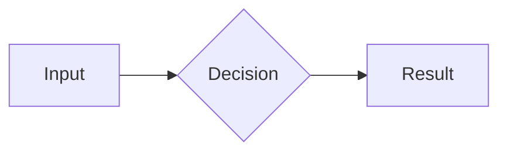

# Obsidian / Hive Context

Save structured documents into the `.hive/` context directory. This directory is symlinked into the user's Obsidian vault, so anything written here appears in Obsidian automatically.

## Context Directory

**IMPORTANT:** `.hive` must be a symlink, not a directory. If it doesn't exist, run
`hive ctx init` to create it — NEVER use `mkdir` for `.hive` itself.

## Document Types and Paths

| Type        | Path                          | Filename Pattern             |
| ----------- | ----------------------------- | ---------------------------- |
| research    | `.hive/research/`             | `YYYY-MM-DD-<slug>.md`      |
| design-doc  | `.hive/design-docs/`          | `YYYY-MM-DD-<slug>.md`      |
| plan        | `.hive/plans/`                | `YYYY-MM-DD-<slug>.md`      |

For research documents, use the `research` skill. For design docs, use the `design-doc` skill. For plans, use the `plan-write` skill. This skill handles ad-hoc documents or types not covered by a dedicated skill.

## Writing a Document

1. **Confirm `.hive/` exists** — if not, run `hive ctx init`
2. **Create the target subdirectory** if it doesn't exist:
   ```bash
   mkdir -p .hive/<subdirectory>
   ```
3. **Gather metadata**:
   ```bash
   git branch --show-current
   git rev-parse --short HEAD
   date +"%Y-%m-%d"
   gh repo view --json nameWithOwner -q .nameWithOwner 2>/dev/null || echo "unknown"
   ```
4. **Generate the filename**: `YYYY-MM-DD-<slugified-title>.md` using today's date
5. **Write the file** with frontmatter and content

## Frontmatter

Every document must start with YAML frontmatter:

```yaml
---
type: "<document-type>"
date: YYYY-MM-DD
repository: owner/repo
branch: [current branch]
commit: [short commit hash]
status: draft
topic: "[Document title]"
---
```

## Formatting

Use standard markdown. When targeting Obsidian rendering, these features are available:

### Callouts

```markdown
> [!TYPE] Optional Title
> Content here.
```

| Callout        | When to use                                          |
| -------------- | ---------------------------------------------------- |
| `[!IMPORTANT]` | Must-read constraints or requirements                |
| `[!WARNING]`   | Risks, gotchas, or things likely to go wrong         |
| `[!QUESTION]`  | Open questions needing resolution                    |
| `[!DECISION]`  | A decision and its rationale                         |
| `[!TRADEOFF]`  | Trade-off comparison between approaches              |

### Mermaid Diagrams

Include diagrams when describing systems with multiple components or data flows:

````markdown

````

## Slug Generation

Convert the title to a filename-safe slug:
- Lowercase
- Replace spaces and non-alphanumeric characters with hyphens
- Strip leading/trailing hyphens

Example: `Auth Service Redesign` -> `auth-service-redesign`
